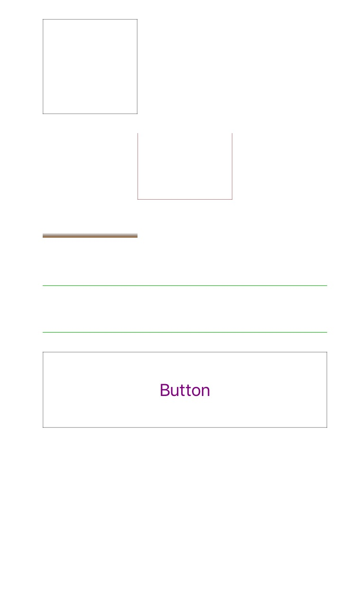

# LPViewBorderMaker

UIView extension of making UIView borders

# Install

`pod 'LPViewBorderMaker', '~> 0.0.1'`

# Usage

```swift
//make borders for edges with default border width and color
- (void)makeBorders;

//make border for a edge which can be top/left/bottom/right with custom border width and color 
- (void)makeBordersWithWidth:(float)width color:(UIColor *)color position:(LPBorderPosition)position;

//make borders for some edges with an array, you can custom border width and color too
- (void)makeBordersWithWidth:(float)width color:(UIColor *)color positions:(NSArray *)positions;
```

# Screenshot



# Release Notes
- 0.0.1
  first commit version
